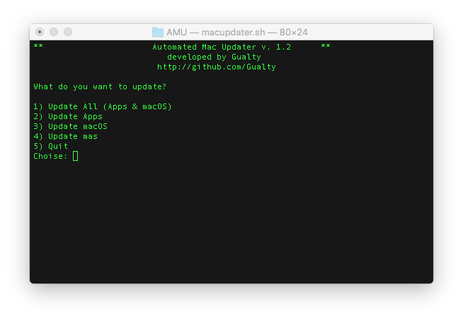

# AMU
## AMU - Automated Mac Updater

**AMU** is a Shell script to **quickly update your Mac** (macOS updates & Mac App Store downloaded apps).

## Requirements
1) A Mac with macOS
2) [mas](https://github.com/mas-cli) installed by brew

## How to use AMU

1) Open Terminal
2) Set correct permission **chmod +x macupdate.sh** (Only the first time before the first execution)
3) Execute AMU **./macupdater.sh**
4) Reboot the Mac if required

**AMU did not require sudo access**

## Why use AMU?

After reading different [blog posts](https://9to5mac.com/2017/07/20/how-to-update-mac-using-terminal/) telling that using *softwareupdate* using Terminal is much faster than update macOS using the Mac App Store, I decided to automatize the operation.
